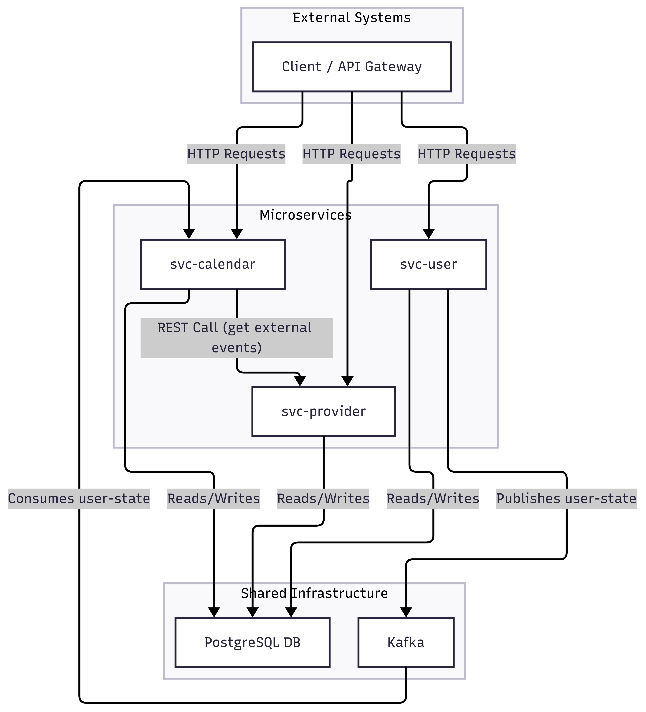

# QA Backend Challenge

**Congratulations!**

Your application for the QA Engineer position has piqued our interest. We’d like to see your style!

This multi-maven project contains a set of simplified microservices that work together to manage `users`, `calendars`, and `events`. The goal of this challenge is to write automated test suites for selected services using:

-   `Java` (min. version 17)
-   `RestAssured` (as an API testing framework)
-   `Junit5` (as a test runner)
-   `AllureReport` (for reporting)

Before you begin, let's explain the system you will be testing.

## Overall Architecture

The system is composed of three main services: `svc-user`, `svc-calendar`, and `svc-provider`. They communicate with each other via REST APIs and asynchronously through Kafka.



### Services

-   **[svc-user](./svc-user/README.md)**: Manages users and their associated calendars. It publishes user state changes to a Kafka topic called `user-state`.
-   **[svc-provider](./svc-provider/README.md)**: Mimics the behavior of an external calendar provider (like Google Calendar, for example). `svc-calendar` calls this service to fetch external events.
-   **[svc-calendar](./svc-calendar/README.md)**: Manages meetings and calendar events. It consumes user data from the `user-state` Kafka topic to stay synchronized and fetches external event data through an API from `svc-provider` to handle event conflicts.

Services are written in `Java 17`, with `SpringBoot 3.1`, using `Postgres` as a database, and `Kafka` as an event-driven asynchronous messaging system.

## Prerequisites

To configure and run the services, you will need:

1.  **Docker**: [https://docs.docker.com/desktop/](https://docs.docker.com/desktop/)
2.  **Docker Compose**: [https://docs.docker.com/compose/install/](https://docs.docker.com/compose/install/)
3.  **Maven 3**: [https://maven.apache.org/install.html](https://maven.apache.org/install.html)
4.  **Java 17 SDK**: [https://docs.oracle.com/en/java/javase/17/install/overview-jdk-installation.html](https://docs.oracle.com/en/java/javase/17/install/overview-jdk-installation.html)

## How to Run

1.  **Start Dependencies**:
    ```bash
    docker-compose up -d
    ```
    This command starts the required infrastructure: PostgreSQL, Kafka, Zookeeper, and Schema Registry. Make sure all services are running and healthy.

2.  **Run the Services**:
    Each service can be run independently using Maven. To run a specific service, navigate to its directory and execute:
    ```bash
    # For example, to run svc-user
    cd svc-user
    mvn spring-boot:run
    ```

## Accessing Tools

-   **Kafka UI**: [http://localhost:8090](http://localhost:8090)
-   **Schema Registry UI**: [http://localhost:8001](http://localhost:8001)
-   **Svc-user Swagger**: [http://localhost:8080/swagger-ui/index.html](http://localhost:8080/swagger-ui/index.html)
-   **Svc-calendar Swagger**: [http://localhost:8082/swagger-ui/index.html](http://localhost:8082/swagger-ui/index.html)
-   **Svc-provider Swagger**: [http://localhost:8083/swagger-ui/index.html](http://localhost:8083/swagger-ui/index.html)
-   **Database (PostgreSQL)**:
    -   **Host**: `localhost`
    -   **Port**: `5432`
    -   **Username**: `postgres`
    -   **Password**: `postgres`
    -   **Databases**: `userdb`, `calendardb`, `providerdb`

## The Challenge

The challenge is to write an automated regression test suite for the `svc-user` and `svc-calendar` services. While `svc-provider` does not need to be tested directly, it will likely be needed to set up test data.

Use all available documentation (Swagger, service source code, and README files) to determine the test scenarios and flows you want to cover.

### Bonus Points

If you have spare time, it would be great to see some load tests as well. This will help us understand your approach to performance testing.
> You can use any framework you feel comfortable for the load test part.

## How to Provide Task Result

1.  Create a private GitHub repository and push the provided code as an initial commit.
2.  Add a `tests` folder in the root path, where you will place your solution.
3.  The solution must include a `README.md` file with instructions on how to execute your tests and your conclusions on any bugs found or improvement suggestions. We want to see your thought process.
4.  Finally, send us the link to your repository and share it with the account(s) specified in the email from your interviewer.

> **To finish the challenge, you can take up to 7 hours in the following 7 days. We trust you to be fair.**
