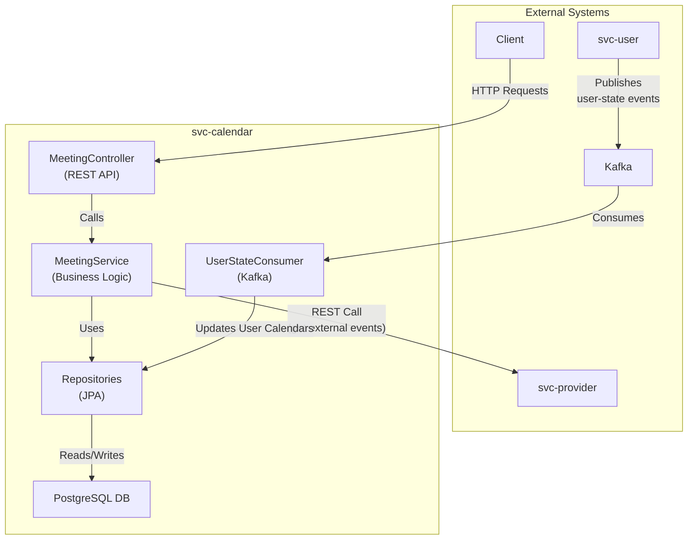
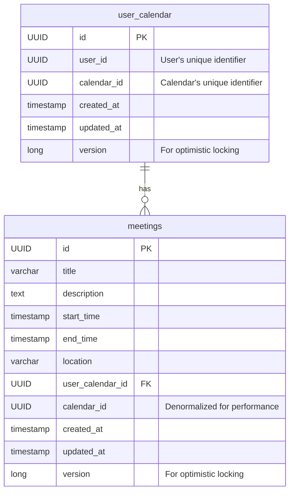

# svc-calendar

The `svc-calendar` is a microservice responsible for managing meetings and calendar events for users. It handles the creation, retrieval, updating, and deletion of meetings, as well as finding available time slots.

## Architecture

The service is a standard Spring Boot application that interacts with a PostgreSQL database. It communicates with other microservices for additional data and consumes events from Kafka to keep its data synchronized.



### Components

-   **MeetingController**: Exposes a RESTful API for all calendar-related operations.
-   **MeetingService**: Contains the core business logic for managing meetings, checking for conflicts, and finding available slots.
-   **Repositories**: JPA repositories (`MeetingRepository`, `UserCalendarRepository`) for database interactions.
-   **UserStateConsumer**: A Kafka consumer that listens to `user-state` topics to create or update `UserCalendar` entities, ensuring the calendar service is aware of all users and their calendars.
-   **External Communications**:
    -   It calls `svc-provider` to fetch external events to consider during conflict checks.
    -   It listens to `svc-user` via Kafka to stay updated on user data.

## Database Model

The database consists of two main tables: `user_calendar` and `meetings`.



-   **user\_calendar**: This table maps a user to a calendar. It is primarily managed by the `UserStateConsumer`, which synchronizes data from the `svc-user`.
-   **meetings**: Stores all information about a specific meeting, linked to a `user_calendar`.

## API Endpoints

All endpoints are available under the `/meeting` base path.

| Method   | Path                                                                                                       | Description                                                    |
| :------- | :--------------------------------------------------------------------------------------------------------- | :------------------------------------------------------------- |
| `GET`    | `/`                                                                                                        | Get meetings by user, calendar, and time range.                |
| `GET`    | `/slots`                                                                                                   | Get available time slots for a user and calendar.              |
| `GET`    | `/{id}`                                                                                                    | Get a specific meeting by its ID.                              |
| `POST`   | `/`                                                                                                        | Create a new meeting.                                          |
| `PUT`    | `/{id}`                                                                                                    | Update an existing meeting.                                    |
| `DELETE` | `/{id}`                                                                                                    | Delete a meeting.                                              |

## How to Run

1.  Ensure Kafka and PostgreSQL are running.
2.  Set the required environment variables or update the `application.yaml` file with the correct connection details.
3.  Run the service using Maven:

    ```bash
    mvn spring-boot:run
    ``` 