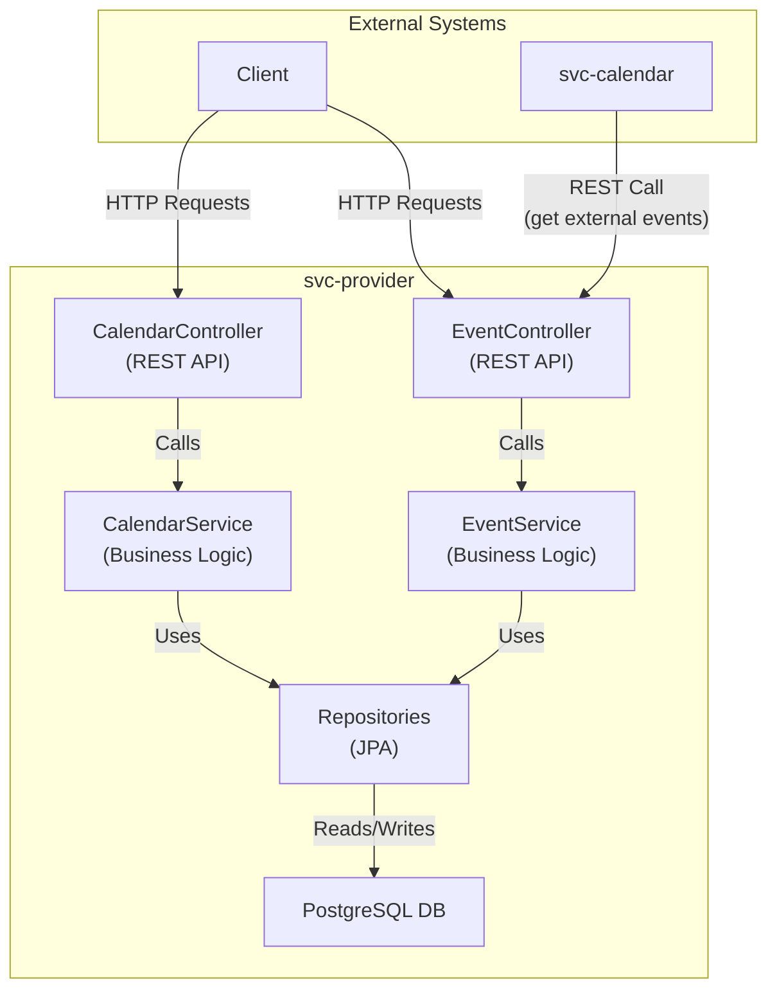
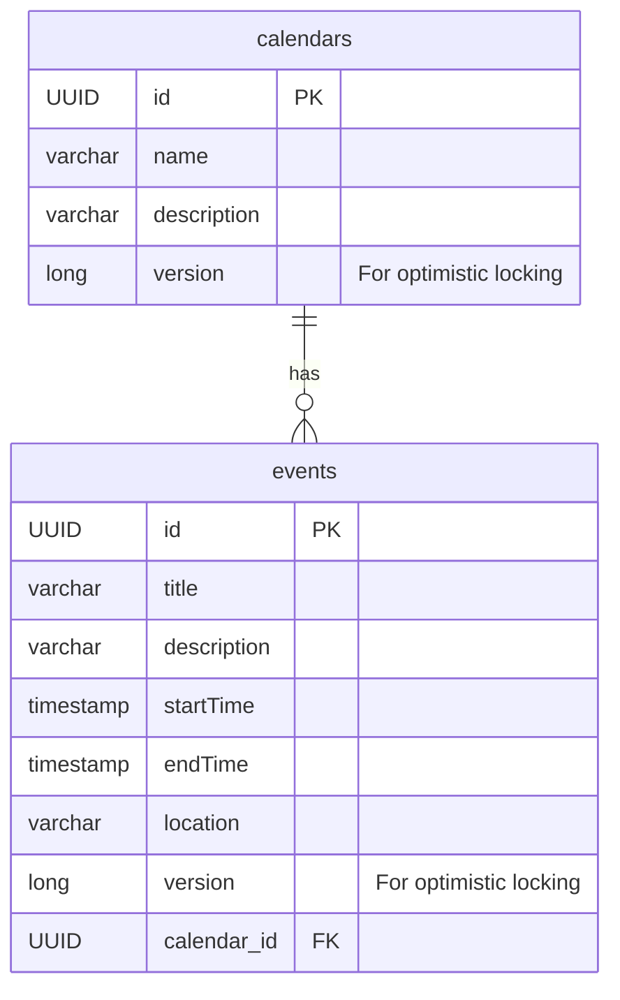

# svc-provider

The `svc-provider` is a microservice responsible for managing calendars and events from external providers. It is consumed by other services, like `svc-calendar`, to fetch external events that might conflict with new meetings.

## Architecture

The service is a standard Spring Boot application that interacts with a PostgreSQL database. It exposes a REST API for managing calendars and their associated events.



### Components

-   **CalendarController**: Exposes a RESTful API for calendar management.
-   **EventController**: Exposes a RESTful API for event management. This is the controller consumed by `svc-calendar`.
-   **CalendarService**: Contains the core business logic for managing calendars.
-   **EventService**: Contains the core business logic for managing events.
-   **Repositories**: JPA repositories (`CalendarRepository`, `EventRepository`) for database interactions.

## Database Model

The database consists of two main tables: `calendars` and `events`.



-   **calendars**: Stores information about a calendar.
-   **events**: Stores all information about a specific event, linked to a `calendar`.

## API Endpoints

### Calendar API

All endpoints are available under the `/api/calendars` base path.

| Method   | Path    | Description                  |
| :------- | :------ | :--------------------------- |
| `GET`    | `/`     | Get all calendars.           |
| `GET`    | `/{id}` | Get a specific calendar.     |
| `POST`   | `/`     | Create a new calendar.       |
| `PUT`    | `/{id}` | Update an existing calendar. |
| `DELETE` | `/{id}` | Delete a calendar.           |

### Event API

All endpoints are available under the `/api/events` base path.

| Method   | Path                              | Description                                      |
| :------- | :-------------------------------- | :----------------------------------------------- |
| `GET`    | `/{id}`                           | Get a specific event by its ID.                  |
| `GET`    | `/calendar/{calendarId}`          | Get all events for a specific calendar.          |
| `GET`    | `/calendar/{calendarId}/timerange`| Get events for a calendar within a time range.   |
| `POST`   | `/`                               | Create a new event.                              |
| `PUT`    | `/{id}`                           | Update an existing event.                        |
| `DELETE` | `/{id}`                           | Delete an event.                                 |


## How to Run

1.  Ensure PostgreSQL is running.
2.  Set the required environment variables or update the `application.yaml` file with the correct connection details.
3.  Run the service using Maven:

    ```bash
    mvn spring-boot:run
    ``` 