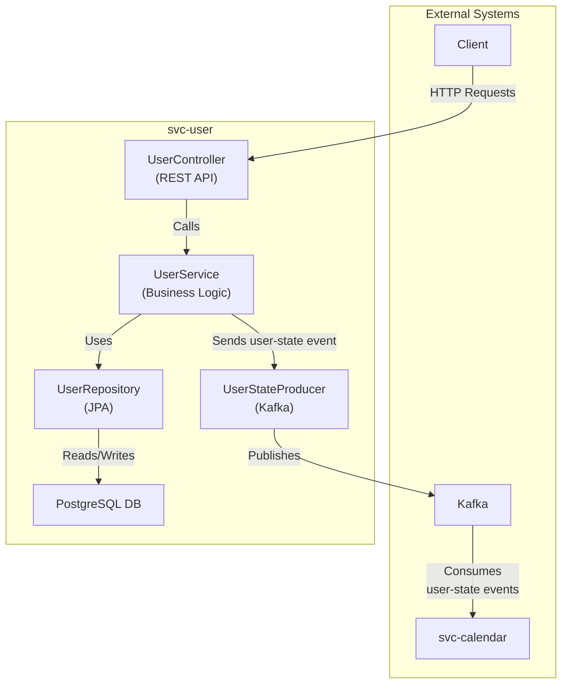
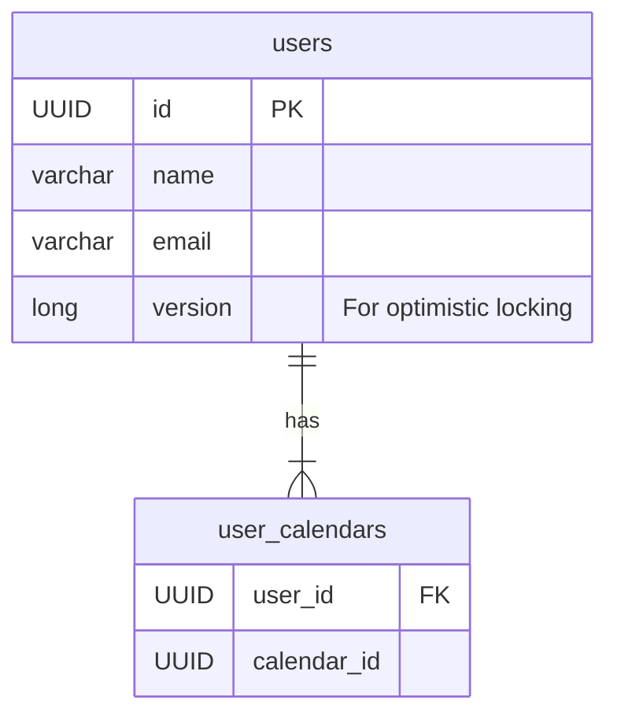

# svc-user

The `svc-user` is a microservice responsible for managing user data, including their associated calendars. It serves as the central point for user information and publishes changes to a Kafka topic to ensure other services can stay synchronized.

## Architecture

The service is a standard Spring Boot application that interacts with a PostgreSQL database. It exposes a REST API for user management and publishes `user-state` events to a Kafka topic whenever a user is created, updated, or deleted.



### Components

-   **UserController**: Exposes a RESTful API for all user-related operations, including managing their calendars.
-   **UserService**: Contains the core business logic for managing users.
-   **UserStateProducer**: A Kafka producer that sends messages to the `user-state` topic whenever a user's data changes. This allows other services, like `svc-calendar`, to maintain a consistent view of user data.
-   **Repositories**: A JPA repository (`UserRepository`) for database interactions.

## Database Model

The database consists of two main tables: `users` and a join table `user_calendars`.



-   **users**: This table stores the core user information.
-   **user\_calendars**: A simple join table that stores the list of calendar IDs associated with a user.

## API Endpoints

All endpoints are available under the `/api/users` base path.

| Method   | Path                               | Description                               |
| :------- | :--------------------------------- | :---------------------------------------- |
| `GET`    | `/`                                | Get all users with pagination.            |
| `GET`    | `/{id}`                            | Get a specific user by their ID.          |
| `POST`   | `/`                                | Create a new user.                        |
| `PUT`    | `/{id}`                            | Update an existing user.                  |
| `DELETE` | `/{id}`                            | Delete a user.                            |
| `POST`   | `/{userId}/calendars/{calendarId}` | Add a calendar to a user.                 |
| `DELETE` | `/{userId}/calendars/{calendarId}` | Remove a calendar from a user.            |

## How to Run

1.  Ensure Kafka and PostgreSQL are running.
2.  Set the required environment variables or update the `application.yaml` file with the correct connection details.
3.  Run the service using Maven:

    ```bash
    mvn spring-boot:run
    ``` 